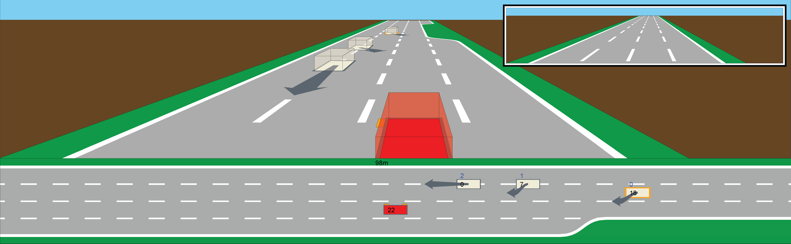

# Model Checking for ADAS
This is the open source project `very fast math`, first announced in [Towards Safe Autonomous Driving: Model Checking a Behavior Planner during Development](https://link.springer.com/chapter/10.1007/978-3-031-57249-4_3). 
We hereby make all the sources of the toolchain public which have so far been published in binary format only ([on Zenodo](https://zenodo.org/records/10013662)).

Thank you for using
~~~
         ___           
.--.--..'  _|.--------.
|  |  ||   _||        |
 \___/ |__|  |__|__|__|
   very fast math
~~~

## VFM Library
`vfm` is a formal verification software for [ADAS](https://en.wikipedia.org/wiki/Advanced_driver-assistance_system) with the [nuXmv model checker](https://nuxmv.fbk.eu/) in its core. It can parse C++ code of an automated driving function (or other) and translate it into a transition system for the nuXmv model checker. Optionally, it can be integrated with an environment model, providing a discrete traffic simulation for the driving function to be verified against. The resulting counterexamples can be visualized and converted into the [OSC2 format](https://www.asam.net/static_downloads/public/asam-openscenario/2.0.0/welcome.html).

## Examples
### MC-generated traffic situation on highway


### MC-generated track and EGO behavior


### Ultra-cooperative driving: live steering of a fleet by model checker


Steered by the MC, a fleet of cars provably* obeys a given SPEC, in this case: invert ordering without colliding. Entrance file: `morty/morty.py`. (* given a whole bunch of assumtions :wink:)

## How to build
`vfm` is implemented in `C++` and can be built with CMake (stable) or Bazel (experimental). With CMake, proceed as follows:
* On Windows, open the top-level `CMakeLists.txt` with Visual Studio and build the `vfm` target.
* On Linux, run the `build.bash` script.

Run `vfm(.exe)` from the `bin` folder.

### Troubleshoot
There are no additional dependencies, except `gtest` if you want to run the tests, and `opengl` if you want to compile fltk agains it. These dependencies are technically optional, but in the recent versions they are required for the build script to work. Should you receive errors, do:
```
sudo apt-get update
sudo apt-get install libgtest-dev
sudo apt-get install libglew-dev
```

## M²oRTy
For the ultra-cooperative driving framework you need additionally `gymnasium` and `highway-env` (as well as python3/pip which we assume you have):
```
pip install gymnasium
pip install "gymnasium[other]"
pip install highway-env
```
Then, run:
```
python3 morty/morty.py
```
### Troubleshoot
For the `--record_video` option to work, you'll need to use a specific older version of highway-env: `pip install highway-env==1.10.1`.

## Authors
Lukas Koenig,
Alexander Georgescu,
Christian Heinzemann,
Christian Schildwaechter,
Michaela Klauck,
Alberto Griggio,
Alberto Bombardelli,
Henning Koch et al.
