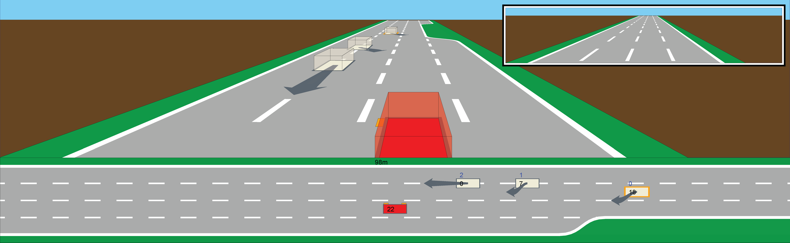

# Model Checking for ADAS
Thank you for using
~~~
         ___           
.--.--..'  _|.--------.
|  |  ||   _||        |
 \___/ |__|  |__|__|__|
   very fast math
~~~

## The Library
`vfm` is a formal verification software for [ADAS](https://en.wikipedia.org/wiki/Advanced_driver-assistance_system) with the [nuXmv model checker](https://nuxmv.fbk.eu/) in its core. It can 
- parse C++ code of an automated driving function (or other) and translate it into a transition system for the nuXmv model checker;
- optionally integrate it with an environment model, providing a discrete traffic simulation for the driving function to be verified against; the results can be converted into scenarios using [OSM](https://wiki.openstreetmap.org/wiki/OSM_file_formats) / [OSC2](https://www.asam.net/static_downloads/public/asam-openscenario/2.0.0/welcome.html).

In **ultra-cooperative driving mode**, a fleet of cars can be steered live in traffic, by provably obeying a set of formal requirements (see below).

## Examples
### MC-generated traffic situation on highway


### MC-generated track and EGO behavior


## How to build
`vfm` is implemented in `C++` and can be built with CMake (stable) or Bazel (experimental). With CMake, simply run 

```build.bash```

*(On Windows, you can alternatively open the top-level `CMakeLists.txt` with Visual Studio and build the `vfm` target.)*

Run `vfm(.exe)` from the `bin` folder.

### Build dependencies
| Dependency | Minimum version | Platform | Notes |
|---|---|---|---|
| CMake | 3.21+ | Both | Required for VS 2022+ generator support |
| GCC/G++ | 7+ | Linux | C++17 support required |
| Visual Studio | 2019+ | Windows | Build Tools or full IDE |
| Git Bash / MSYS2 | — | Windows | Only for using `build.bash` to compile |

### Troubleshoot
There are no additional dependencies, except `gtest` if you want to run the tests, and `opengl` if you want to compile fltk agains it. These dependencies are technically optional, but in the recent versions they are required for the build script to work. Should you receive errors, do:
```
sudo apt-get update
sudo apt-get install libgtest-dev
sudo apt-get install libglew-dev
```

## M²oRTy (Ultra-Cooperative Driving)
Safe trajectories by dis-proof of their non-existence.

https://github.com/user-attachments/assets/185897fe-c9f0-415a-b5c1-19f09b66bc73

https://github.com/user-attachments/assets/91c121bc-fe8a-4ee3-83e7-db243c79ec54

https://github.com/user-attachments/assets/0fe0c22f-3a62-4c92-a389-8c9bb43a658a

https://github.com/user-attachments/assets/672a190b-dda9-46ae-8ea5-2d1d5d000d5e

https://github.com/user-attachments/assets/7808511b-9011-4f86-9ca4-aa56a24c6255

https://github.com/user-attachments/assets/ad738fd3-6bef-4342-a084-2b2d9e7901ef

https://github.com/user-attachments/assets/c37c1992-e551-4de4-b90b-2dd72453c255

The nuXmv model checker steers several cars cooperatively to accomplish a given formal goal. In the example, two cars pass each other on a narrow road with parked cars ("Nudging") with safe, shortest possible collective trajectories. 

(TL;DR: for details see [the paper](https://link.springer.com/chapter/10.1007/978-3-032-22752-2_31).)

### Running M²oRTy
For the UCD framework you need additionally `gymnasium` and `highway-env` (as well as python3 with pip which we assume is there):
```
pip install gymnasium
pip install "gymnasium[other]"
pip install highway-env
```

Run from the project root directory, for example:
```bash
python -m morty.morty --num_runs 1 --steps_per_run 300 --headless --record_video
```
The task to solve is defined in `morty/envmodel_config.tpl.json`. Use the `morty/master_templates` for a first trial.

## Notes
The `very fast math -- Model Checking for ADAS` project is [open-source](https://github.com/coenig/very-fast-math). Academic publications:
- TACAS 2024: [Towards Safe Autonomous Driving: Model Checking a Behavior Planner during Development](https://link.springer.com/chapter/10.1007/978-3-031-57249-4_3)
- IEEE Transactions on Intelligent Transportation Systems: [Exploiting Formal Verification for the Systematic Discovery of Corner Cases in a Behavior Planner for Automated Driving](https://ieeexplore.ieee.org/document/11523162)
- TACAS 2026: [Driving by Disproof: A Practical Model Checking Approach to Fleet Coordination](https://link.springer.com/chapter/10.1007/978-3-032-22752-2_31)
- Work in progress: Ultra-Cooperative Driving -- Safe Trajectories from Dis-Proof of their Non-Existence (to be submitted to: IEEE Transactions on Intelligent Transportation Systems)

## Authors
Lukas Koenig,
Alexander Georgescu,
Christian Heinzemann,
Christian Schildwaechter,
Michaela Klauck,
Alberto Griggio,
Alberto Bombardelli,
Henning Koch et al.
